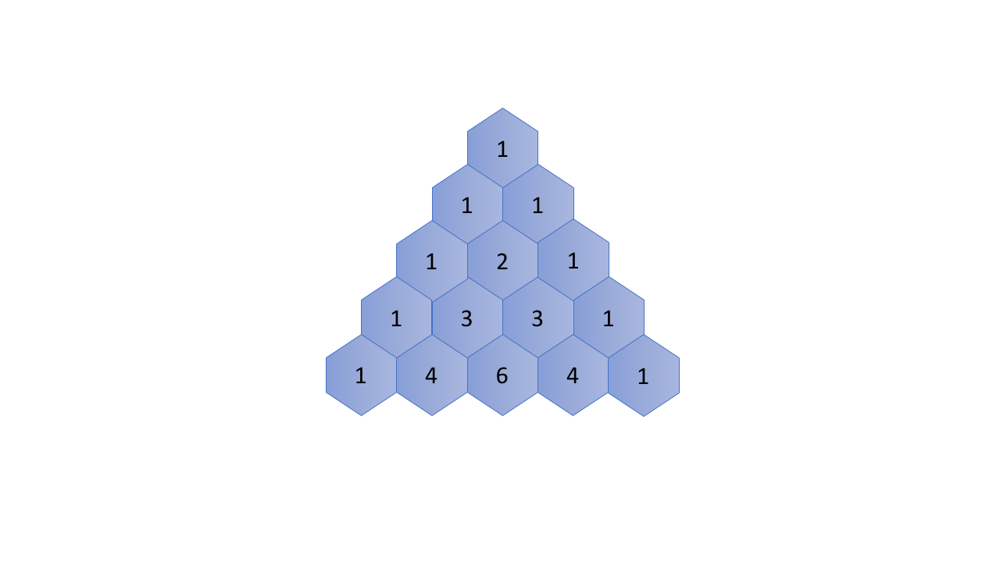

### Pascal's Triangle

Pascal's triangle are a series of numbers arranged in the shape of triangle. In Pascal's triangle, 
the leftmost and the rightmost numbers of each row are always 1. 
For the rest, each number is the sum of the two numbers directly above it in the previous row.

#### Recurrence Relation
Let's start with the recurrence relation within the Pascal's Triangle.
First of all, we define a function f(i, j)f(i,j) which returns the number in the Pascal's Triangle in the i-th row and j-th column.

We then can represent the recurrence relation with the following formula:

f(i, j) = f(i - 1, j - 1) + f(i - 1, j)
f(i,j)=f(i−1,j−1)+f(i−1,j)

#### Base Case
As one can see, the leftmost and rightmost numbers of each row are the base cases in this problem, which are always equal to 1.
As a result, we can define the base case as follows:

f(i, j) = 1 where  j = 1  or  j = i

`
/* return the nth row of the pascal's triangle */
    vector<int> getRow(int rowIndex) {
        vector<vector<int>> m(rowIndex+1);
        for(int i=0;i<rowIndex+1;i++)
        {
            m[i].resize(i+1);
            m[i][0]=1;
            m[i][i]=1;
            for(int j=1;j<i;j++)
            {
                m[i][j]=m[i-1][j-1]+m[i-1][j];
            }
        }
        return m[rowIndex];
 
    }

`
